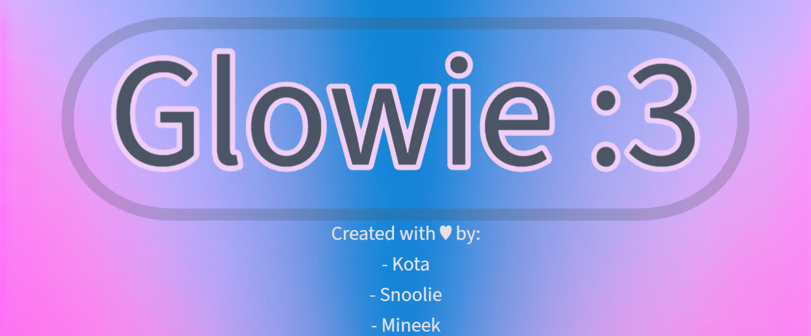

# Glowie
Glowie is an iOS 12-16 tweak that brings a more colorful look to your Icon Labels!!

## Features
(Uses Alderis Color Picker)
    - Adjustable Border Colors for Icon Labels
    - Adjustable Background Colors for Icon Labels
    - Adjustable Text Colors for Icon Labels
    - Adjustable Width of Borders for Icon Labels
    - Adjustable Corner Radius for Icon Labels

## Installation
1. Download the latest `deb` from the [releases](https://github.com/mineek/Glowie/releases) or from Kota's Repo-[Transrights.online](https://transrights.online/) with your preferred package manager.
2. Install Glowie!

## Compatibility
iPhone, iPad and iPod running iOS/iPadOS 13 or later
(rootful & rootless)

## Compiling
  - [Theos](https://theos.dev/) is required to compile the project
  - Depends on [Alderis](https://github.com/hbang/Alderis)
  - You may want to edit the root `Makefile` to use your Theos SDK and toolchain

## License
Needed
